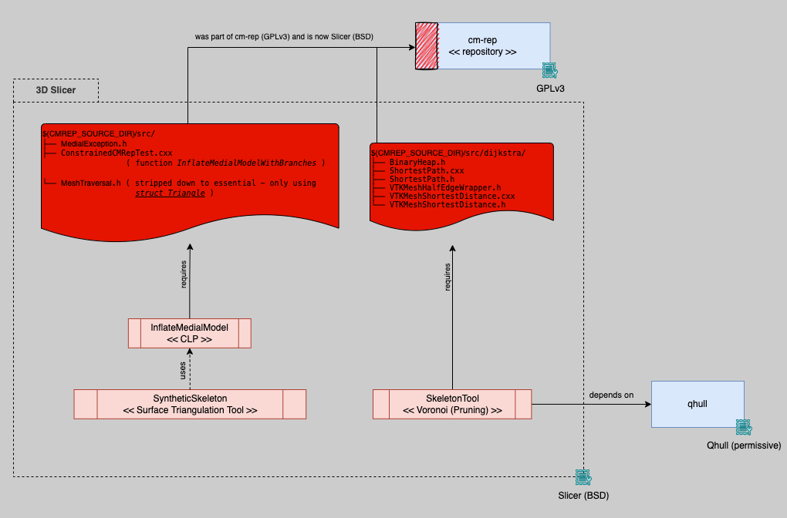
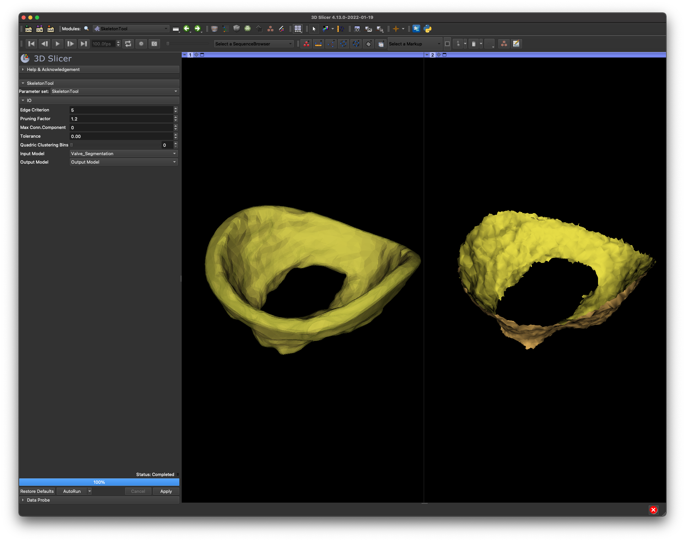
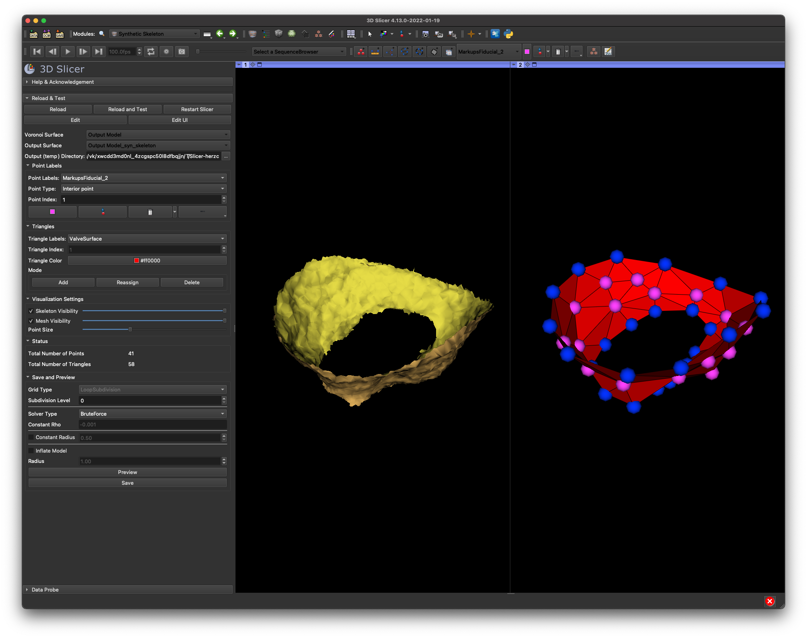
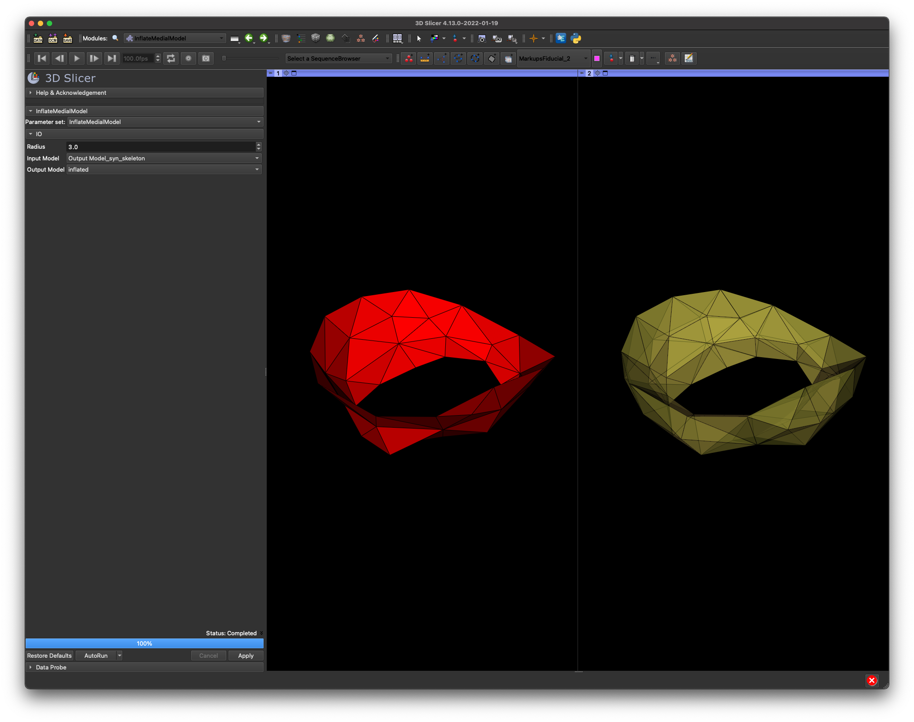

# MedialSkeleton 3D Slicer extension

This extension provides ways to create medial skeletons using Voronoi with additional cleaning steps and the option to
create synthetic skeleton by manually triangulating points. For example, the resulting synthetic skeleton can be used as
a medial template alongside additional output parameter files to create Continuous Medial Representation (CM-Rep).

Further information regarding CM-Rep can be found at https://github.com/pyushkevich/cmrep

## Overview and Dependencies

Original cm-rep author [Paul Yushkevich](https://github.com/pyushkevich) granted permission to distribute the
source/header files (**in the red boxes**) required to compile _InflateMedialModel_ and _SkeletonTool_ under
the [Slicer BSD license](License.txt).

## Modules

All modules mentioned below originated from standalone Skeletonize GUI (https://github.com/pyushkevich/cmrep_skelGUI).

### SkeletonTool (Command Line Program)

Create a Voronoi skeleton using [qhull](https://github.com/qhull/qhull) from a volumetric input surface model with the
option to enable additional cleaning (pruning) of hanging triangles of the resulting skeleton.

### Synthetic Skeleton

Creation of a synthetic skeleton (a medial template) e.g. in preparation to run CM-Rep for fitting a medial surface to
image data.

### InflateMedialModel (Command Line Program)

Creation of an inflated model from a skeleton.

